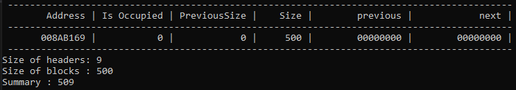
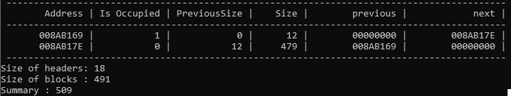
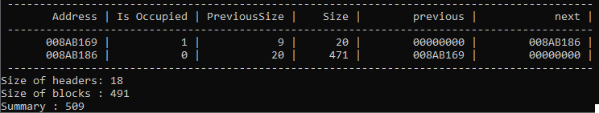

# MemoryAllocator
### Description
A project of creating memory allocator in C++. 
It is a test implementation of a memory allocator based on byte array to practive and visualize algorythms of memory allocation.
Option of allocating and deallocating memory is very common and convenient in C++/ It gives user more controll of the resourcess of the program.
In not only gives the programmer flexibility in optimizing meory usage but also gives performance benefits compared to outomatic garbage collectors.
For systems with limited resources memory alocation controll is cruciall.

### Algorythm Description
#### Overwiev
This implementation uses C++ pointers to move between blocks in memory.
Each block consists of two parts: header and Data.
Header's size is constant and is equal to 9 bytes.
It consists of 3 fields, that store information about wether the block is occupied(1 byte), the size of Data part of this block(4 bytes) and the size of previous block(4 bytes).
#### `void* mem_alloc(size_t size)` function
This function allocates a new memory block of the requested size.
It fulfills the task by means of finding the best solution.
`mem_alloc` goes through the whole memory to find the smallest empty block that has enough memory to allocate a new block ofrequestesd size.
This approach provider racional memory usage, so that the user could store the biggest possible amount of data.
#### `void* mem_realloc(void* addr, size_t size)` function
Use it when you ned to change the size of a particular memory block.
`addr` is a pointer to the block you want to resize. `size` - is the new size of that block.

##### Behaviour
**If the requested block size is smaller than current**, the current block will be split in two.
The first part is alocated and returned as a result of a function. 
The second also becomes a block, and `mem_free` operation is performed, to make the block free and unite it with the next block in case the following is empty.

**If the requested block size is smaller than current**, there are two possible options:
- If the next block combined with current block give more space than enough for reallocation, the following block is split in two. The first part is merged with the first block to make a new block of necessary size. The second part is used instead of the inicial second block.
- If the second block is empty and no more space is left to split it, the two blocks are merged.
- if none of the previous options were possible, the new memory block is allocated using `mem_alloc` and current block is cleared.

#### `void mem_free(void* addr)` function
The function deletes the data of the block, flags it as the 'free memory' block and tries to merge with adjacent 'free memory' blocks, if present.

### Usage Examples
#### Create block with the size of 500 bytes
##### Code Example
```
memoryBlock = createBlock(500);
```
##### Console Output


#### Allocate 10 bytes of memory
##### Code Example
```
void* x = mem_alloc(10);
```
##### Console Output


#### Realocate the block from 10 to 20 bytes
##### Code Example
```
void* x = mem_realloc(x, 20);
```
##### Console Output


#### Free the block of memory
##### Code Example
```
mem_free(x);
```
##### Console Output

